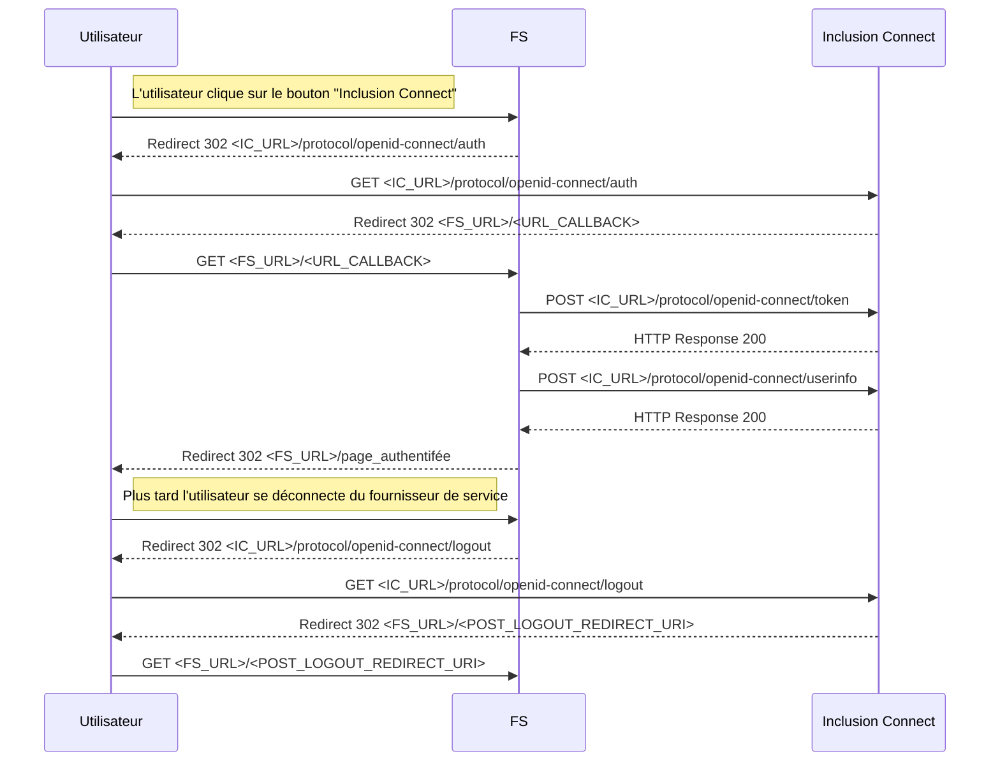

# Concepts de base

## Le protocole OpenID Connect

### Introduction

Inclusion Connect fonctionne avec le protocole OpenID Connect. Ce protocole est une surcouche d'identification au protocole OAuth 2.0 qui permet à des Clients (les fournisseurs de service) d'accéder à l'identité des Utilisateurs finaux (les internautes) par l'intermédiaire d'un serveur d'autorisation (Inclusion Connect).

Les fournisseurs de service doivent donc être des clients OpenID Connect (aussi appelés _relying parties_). Inclusion Connect est un fournisseur OpenID Connect (aussi appelé _OpenID Connect Provider_).

La spécification du protocole se trouve sur http://openid.net/connect/.

Pour une référence d'implémentation OpenID Connect voici le lien : http://openid.net/specs/openid-connect-core-1_0.html

### Les Flux Standards

Le protocole OpenID Connect définit 3 appels REST faits par le client, et 4 endpoints (un du côté client, et trois du côté provider).

En amont, le client s'inscrit (en général manuellement) auprès du provider. Il lui fournit une URL de callback (l'URL du client vers lequel l'internaute est redirigé une fois authentifié), aussi appelée "callback endpoint". En retour le provider donne au client un client ID et un client secret.

Lorsque l'internaute clique sur le bouton d'authentification du client, le flux est le suivant :

- Le client fait une redirection vers le "authorization endpoint" du provider avec son client id et son url de callback. Le provider redirige alors l'internaute vers sa mire d'authentification. Si l'internaute se loggue correctement, le provider renvoie un code d'autorisation au client.
- Le client fait un appel Web service vers le "token endpoint" du provider avec le code d'autorisation reçu, et authentifie cette requête avec son client id et son client secret. Le provider retourne un access token (une chaîne de caractères encodée en base64), un id token (sous la forme d'un Json Web Token), et parfois un refresh token (une chaîne de caractères en base64).
- Le client fait un appel Web service vers le "userInfo endpoint" du provider avec l'access token reçu, et le provider renvoie les informations de l'internaute au client.

Enfin, lorsque l'internaute se déconnecte du fournisseur de service, on s'attend à ce qu'une redirection soit faite vers le "logout endpoint" du provider afin de clore la session en cours.

## Les données usagers

Les données usagers sont fournies par Inclusion Connect, conformément à l'habilitation obtenue.
Ces données comprennent :

- Email
- Nom de famille
- Prénom

Inclusion Connect transmet systématiquement au Fournisseur de Service un identifiant unique pour chaque utilisateur.

# Utiliser Inclusion Connect pour authentifier des utilisateurs

Afin d'implémenter Inclusion Connect, il faut un compte pour votre fournisseur de service sur les plateformes d'intégration et de production.

## Nos endpoints

Le format des urls est le suivant :

|               |                                                                              |
|           --- | ---                                                                          |
| Authorization | https://{hostname}/auth/realms/{realm-name}/protocol/openid-connect/auth     |
| Token         | https://{hostname}/auth/realms/{realm-name}/protocol/openid-connect/token    |
| UserInfo      | https://{hostname}/auth/realms/{realm-name}/protocol/openid-connect/userinfo |
| Logout        | https://{hostname}/auth/realms/{realm-name}/protocol/openid-connect/logout   |

Contactez l'équipe du projet pour obtenir les variables de production et de recette.

## Détail du fonctionnement

## Détail des flux

- Le détail des flux peut être trouvé
[en anglais sur cette page](https://openid.net/specs/openid-connect-core-1_0.html#AuthorizationEndpoint).
Voir plus bas pour les particularités d'Inclusion Connect.

- France Connect propose une documentation en français du protocole tel qu'ils l'utilisent.
Cherchez `Détail des flux` sur
[cette page](https://partenaires.franceconnect.gouv.fr/fcp/fournisseur-service).

# Particularités d'Inclusion Connect

## Mauvais paramètre de redirection lors de la déconnection

Dans la version 16 de Keycloak (actuellement utilisée) le paramètre de redirection de l'endpoint
logout ne s'appelle pas `post_logout_redirect_uri` mais `redirect_uri`.
C'est un bug qui est corrigé dans les versions plus récentes.

## Personnalisation du fournisseur de service

Le thème actuel permet de personnaliser Inclusion Connect en fonction du Fournisseur de service.
Cette personnalisation se fait à l'aide d'un paramètre `from` ajouté lors de l'appel au endpoint `Authorization`.
Les valeurs gérées actuellement sont `emplois`, `dora` et `communaute` mais d'autres peuvent être ajoutées.

En l'absence de ce paramètre, le logo du fournisseur de service n'est pas affiché.
